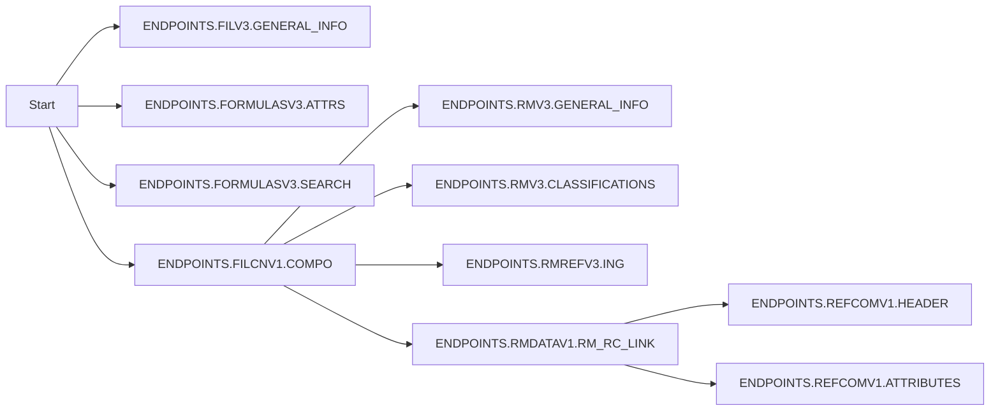

# Planification du dévelommement d'une US
## Un cas concret: Écriture d'une nouvelle fonctionnalité
### Intro
Pour rendre la suite un peu plus concrète, on va partir d'une spec réaliste mais pas trop complexe:
Nous sommes au sein d'un (gros) module en JS pur d'un exécutable (front ou back, ça ne change rien). Ce module génère des informations à différents moments de son exécution (assez linéaire), et on veut récupérer une partie de ces informations pour générer un récapitulatif sur la nature des données qu'on manipule, sous la forme d'un texte de quelques paragraphes. Le texte est à retourner une fois l'exécution du module effectué, dans la fonction qui appelle l'exécution du module. Ce qui est fait du texte par la fonction appelante (l'envoyer par mail, l'afficher à l'utilisateur dans une popup, etc.) n'est pas du ressort de cette US.

Pour simplifier la suite, on va parler d'Exécuteur de Tâches Complexes (ETC) pour le module dont on va récupérer les informations, et de synthétiseur pour le module qu'on va développer et qui vise à synthétiser les informations récoltées.

### Détails techniques
l'ETC est concevable comme le nanoservice "retrieve" d'eCSAR - bien qu'il ne soit pas exécutable mais un module dans une plus grande app: à partir notamment d'un `formula number` et d'un `fil code`, il effectue de multiples appels ordonnancés à des APIs de notre client favori, les arguments de certains appels dépendant du résultat d'autres appels.

Voici un graphe simplifié des dépendances des appels:



Voici la fonction (simplifiée) appelant l'ETC:
```
const log = Logger.get("load-formula-compo");
export const loadFormulaCompositionDataFromAPIs = async ({
  formula_number,
  fil_code,
  logger,
}) => {
  log("Start retrieve module");
  log("Start retrieving endpoints");
  const scrapped_with_warnings = await endpointsResponses({formula_number, fil_code, log});
  log("End retrieving endpoints");

  const scrapped = scrappedWithoutWarnings(scrapped_with_warnings);
  // const rms = scrapped[ENDPOINTS.FILV3.GENERAL_INFO].RawMaterials;
  // const refcoms = scrapped[ENDPOINTS.FILV3.GENERAL_INFO].RawMaterials.flatMap(({RawMaterials}) => RawMaterials.commercial_references);
  const warnings = getWarnings(scrapped_with_warnings);
  const result = {
    scrapped,
    warnings,
  };

  log("End retrieve module");
  return result;
}
```

Et voici l'ETC:
```
const endpointsResponses = async ({formula_number, fil_code, log}) => {
  const api = new ApiGeeApi(username);

  const [
    formulas_complete,
    other_responses,
  ] = await Promise.all([
    async () => {
      const res = await api.fetch(ENDPOINTS.FLADATAV1.COMPLETE, {
        FormulaCodes: [formula_number],
      })

      log("Loaded ENDPOINTS.FLADATAV1.COMPLETE response");
      return res;
    },
    fetchRMs({api, fil_code, formula_number, log}),
  ]);

  const scrapped = {
    [ENDPOINTS.FLADATAV1.COMPLETE]: formulas_complete,
    ...other_responses,
  };

  return scrapped;
};
```

Certains appels nécessitent en plus qu'on leur passe un bearer token obtenu via une procédure d'authentification OAuth incluant le endpoint `ENDPOINTS.OAUTH`.

Pour chaque noeud non terminal du graphe, il y a une fonction qui l'appelle et qui appelle les fonctions dépendant du résultat de l'appel au endpoint. Exemple (pseudo-code):
```
const fetchRawCommercialRefs = async ({some_info, log}) => {
  const scrapped = {};
  const input_rm_rc_link = getRmRcLinkInput(some_info);
  scrapped[ENDPOINTS.RMDATAV1.RM_RC_LINK] = await fetch(ENDPOINTS.RMDATAV1.RM_RC_LINK, input_rm_rc_link);

  const refcom_header_res = await fetchRefcomsHeaders(some_info, scrapped[ENDPOINTS.REFCOMV1.HEADER]);
  log("fetchRefcomsHeaders done");

  const refcom_attributes_res = await fetchRefcomsAttrs(some_info, scrapped[ENDPOINTS.REFCOMV1.ATTRIBUTES]);
  log("fetchRefcomsAttrs done");

  Object.assign(scrapped, {
    [ENDPOINTS.REFCOMV1.HEADER]: refcom_header_res,
    [ENDPOINTS.REFCOMV1.ATTRIBUTES]: refcom_attributes_res,
  });

  return scrapped;
}
```

### Détails fonctionnels
Munis de ces informations, nous pouvons mieux visualiser les détaisl suivants de la description de notre US:
1. Nous souhaitons récupérer les informations suivantes:
   - durée d'exécution totale
   - nombre total de matières premières récupérées (longueur du tableau de RMs renvoyé par ENDPOINTS.FILCNV1.COMPO)
   - nombre total de références commerciales récupérées (longueur du tableau de refcoms renvoyé par ENDPOINTS.RMDATAV1.RM_RC_LINK)
2. Nous souhaitons un message récapitulatif semblable à: "La récupération des réponses des APIs externes a duré au total 26 seconde(s). 12 matières premières et 53 références commerciales ont été récupérées."

## Inventorier et définir les grandes étapes
Commençons par lister les différentes tâches qui vont composer l'implémentation de notre US:
- **écrire l'interface avec le code existant**: quelle information est un argument du point d'entrée (fonction) du synthétiseur que je vais écrire? Quelle info viendra des variables d'environnement? Comment es-ce que j'expose de potentiels accesseurs/mutateurs de l'état interne du synthétiseur?
- **étudier l'environnement**: une instance du synthétiseur intéragit avec plusieurs parties du code - assez éloignées les unes des autres, comment vais-je faire pour que cette instance puisse intéragir en ces différents points sans avoir à trop réécrire l'ETC? Le synthétiseur doit stocker des données pendant un temps; vais-je le faire sous la forme d'un objet stateful ou vais-je déléguer la gestion de la persistence de la donnée à un outil tierce (store, modèle, appel réseau, ...)?
- imaginer l'architecture du synthétiseur (design technique): cf les décisions architecturales ci-dessous
- écrire le coeur de fonctionnalité (grosso modo l'ensemble des sous-fonctionnalités à l'exclusion des interfaces)
- écrire les interfaces d'inputs
- écrire l'interface d'output
- Point de contrôle: faire marcher le PoC

### Quelques décisions architecturales de conception / "design"
Je dois recueillir des info à des moments différents, puis restituer le tout en une fois en le transformant.

#### Endpoints
Je vais au moins avoir les endpoints suivants:
- pour chaque info (ou pour toutes les info d'un coup), un endoint de récupération de l'info
- celui permettant à la fonction invocatrice d'obtenir à la fin de l'exécution du module le texte généré
- Si utilisation d'un store externe, je dois soit le passer en argument du synthétiseur à son invocation, soit le hardcoder (via un import par exemple).

#### Sous-fonctionnalités
Je vais au moins avoir les fonctionnalités suivantes:
- une sous-fonctionnalité d'hydratation de template, par ex. `getFinalMessage(informations)`, branchée pas loin 
- une sous-fonctionnalité de récupération des diverses informations, éventuellement une par information (par exemple `setStartDate`/`setEndDate`/`setTitle`).

#### Forme générale
Je ne vais pas avoir énormément de sous-fonctionnnalités, je vais me contenter d'une classe stateful. Pas de store externe donc (meilleure modularité à ce niveau), mais il va falloir que j'insère mon synthétiseur à différents endroits dans le code de l'ETC - et donc le code hébergeant ma fonctionnalité sera dépendant de celle-ci. Autre raison de ne pas adopter le store externe: le synthétiseur en devient dépendant, que le couplage soit faible (store passé en argument du synthétiseur) comme fort (store hardcodé dans le synthétiseur); la solution alternative est de faire une interface d'abstraction du store, mais c'est une grosse surcharge de code par rapport aux solutions alternatives, et le synthétiseur n'a pas vocation à être réutilisable.

Une solution alternative serait de transformer le code de l'ETC pour lui créer des hooks que mon synthétiseur utilisera - et qui du coup rendra l'ETC modulaire; mais je préfère dans un premier temps garder le code plus simple & rapide à écrire, surtout que l'ETC est un gros module, et je ne veux pas l'alourdir ni alourdir son interface si je peux éviter. Si j'avais prévu que l'ETC soit réutilisable, j'aurais peut-être adopté cette dernière approche.

## Ordonner les étapes / faire une mini-roadmap
Maintenant que j'ai toutes ces tâches, je peux décider de les ordonnancer de différentes manières:
- est-ce que je commence par écrire le coeur de fonctionnalité? Si j'utilise une lib externe (un moteur de rendu de vues par exemple) pour le templating, je peux être plus à l'aise de me "débarrasser" de cette tâche en premier, pour ensuite me concentrer sur la complexité des interface. En faisant les tâches dans cette ordre, je vais adopter une **approche synthétique** (comme en dissertation): je vais des détails (d'implémentation & sous fonctionnalités) au plus général (les points d'interface, qui appellerontplusieurs fonctions, qui appelleront eux-même plusieurs fonctions, etc).
- est-ce que je commence par écrire les (points d')interfaces? Je peux vouloir faire ça en premier car je n'ai pas vraiment d'idée du détail de la forme du synthétiseur, et je vais laisser la forme se créer au fil de l'écriture. En faisant les tâches dans cette ordre, je vais adopter une **approche analytique** (comme en dissertation): je vais du plus général aux détails.
- Des **approches hybrides** sont également possibles, ce qui compte c'est de ne pas oublier d'étapes et de savoir où on va quasiment à chaque instant :-)

## Gérer l'incertitude
Après ces différents ordonnancements, il faut aussi gérer l'incertitude: est-ce que mon module est aussi facile à développer que ce qu'on vient de voir? Ne va-t-on pas rencontrer des obstacles? Se retrouver bloqués en pensant qu'on a tout écrit comme il le faudrait, mais la console nous signale tout de même une erreur fatale?

### Optimisation du debug & aération du code
La technique de debug la plus répandue, c'est via `console.log`. On va optimiser le code de façon à permettre de les insérer pour logger la valeur de n'importe quelle variable facilement, sans avoir besoin d'adapter le code alentours. Cela va par ricochet améliorer l'aération de notre code, et donc la lisibilité.

Notez que les debuggers sont également une option de debugging à creuser, mais je ne vais pas en parler ici. Les loggers spécialisés, comme le module NPM `debug`, sont aussi une option intéressante, et vont également bénéficier de ce qui suit.

#### console.log efficace
La forme de base de `console.log` lorsqu'on veut débugger: `console.log(ma_variable)`. Ça fait le job, mais quand on en met 3 à différents endroits d'un processus non linéaire (par exemple au sein et hors d'un `array.map()` ou dans différentes fonctions qui s'appellent conditionnellement `const value_final = should_process ? doProcess(value) : value;`), on a du mal à s'y retrouver dans la console.

On va donc ajouter un tag à chacun de nos logs. Le choix est vôtre, voici le mien:
```
const determineErrorTextClass = (children, business_type, is_link_to_ingredient) => {
  if (is_link_to_ingredient) {
    const className = styles[`${business_type}-error-text`] || "";
console.log("determineErrorTextClass > if (is_link_to_ingredient)", {className, business_type})
    return className;
  }
  ...
};
```

Remarquez que j'ai ajouté les variables à logger dans un objet; ça permet d'avoir leur nom (et donc d'éviter le mental mapping), mais aussi de pouvoir en mettre plusieurs d'un coup.

J'ai également cassé l'indentation, pour me permettre de repérer plus facilement les lignes à retirer avant un commit.

La bibliothèque standard contient beaucoup d'autres fonctionnalités de logging qui peuvent nous aider dans notre debug:
- https://www.kilukru.dev/javascript-console-log-trucs-et-astuces/
- https://blog.logrocket.com/keeping-it-simple-with-the-javascript-console/

#### Immutabilité
Par exemple, on va plus souvent utiliser des `const` et l'immutabilité, plutôt que des `let`/`var` + mutation de la variable.

#### return
Également, on va `return` (quasi-)systématiquement une variable, et jamais une expression:
```
// BAD
return arr_a.concat(arr_b);

// GOOD
const arr_a_b = arr_a.concat(arr_b);
return arr_a_b;

// La dernière ("good") solution nous permet de logger l'ensemble de nos résultats d'expressions:
// console.log("ma fonction", {
//   arr_a_length: arr_a.length,
//   arr_b_length: arr_b.length,
//   arr_a_b_length: arr_a_b.length,
// });
```

#### Construction d'objet (& autre type non primitif)
On sépare la génération de la valeur de son agencement dans une structure.

```
// BAD
const my_obj = {
  is_first_cell_of_line: is_business_check ? children.cell_index == 0 : false,
  business_type: is_business_check ? children.business_check_type : null,
  value: is_first_cell_of_line ? children.value : children,
  is_link_to_ingredient: !children?.is_link_to_ingredient ||
  (children?.is_link_to_ingredient && children?.is_error_ingredient),
};

// GOOD
const is_first_cell_of_line = is_business_check ? children.cell_index == 0 : false;
const business_type = is_business_check ? children.business_check_type : null;
const value = is_first_cell_of_line ? children.value : children;
const is_link_to_ingredient = !children?.is_link_to_ingredient ||
  (children?.is_link_to_ingredient && children?.is_error_ingredient);

const my_obj = {
  is_first_cell_of_line,
  business_type,
  value,
  is_link_to_ingredient,
};
```

### Chiffrage d'une US
Cette étape arrive normalement avant de commencer l'US. Toutefois ce que nous avons vu précédemment est directement utilisable pour affiner le chiffrage, et éviter de le faire au doigt mouillé.

#### Technique de chiffrage: gestion de l'incertitude
On utilise le système de points proposés par SCRUM. Notez que cette méthode n'est pas recommandée par SCRUM, mais je la trouve nettement plus simple cognitivement à mettre en place et elle donne de plutôt bons résultats.

Le calcul est le suivant: `Nombre de points = base + incertitude`.

##### Base
Pour la base, il s'agit du temps de développement de la tâche "quand tout va bien", que "les étoiles sont alignées"; bref, le cas idéal.

Si les devs ne sont pas certains de sur quelle base commune chiffrer cette partie, je propose 15 points par personne et par semaine, en moyenne. Si ça n'est toujours pas suffisant pour chiffrer: un travail estimé a priori à moins d'1H est de 1 point, de plus d'une journée de 3 points, de plus de 2 jours de 6 points, etc.

##### Incertitude
L'incertitude va être un pourcentage sur le nombre de points de la base. À quel point un danger plane sur l'US, et l'obstacle risque d'en ralentir sa réalisation?

TODO incertitude: 20% basse, 50% moyenne, 100% (ou plus): haute.

##### Complément
Une partie de ce que SCRUM appelle la complexité se divise en base et en complément.
Au moment où je chiffre une US, j'arrive mentalement à me représenter une partie de la structure - et donc de la complexité - de la codebase actuelle. Cette modélisation me permet de chiffrer la partie "base". Le reste (ce que je n'arrive pas à me représenter) de la complpexité de la codebase se retrouve dans le chiffrage de l'incertitude.

##### Exemple
Deux devs junior, un front et un back, ont commencé un projet depuis 3 semaines. Ils ont travaillé sur la mise en place d'une app dont les spécifications métier ont été livrées il y a à peine quelques jours; ils ont donc plutôt travaillé sur des fonctionnalités non-métiers, comme l'authentification, la mise en place d'un boilerplate, d'une CI et d'une CD, le back est branché sur la DB, etc. L'application réussit pour l'instant à afficher en front une config utilisateur stockée en DB. Elle va utiliser un framework de composants ReactJS connu.

Ils n'intéragissent pour ainsi dire pas avec le code de l'autre, et se synchronisent avec un swagger et des feature flags. Ils ont tous les deux été sensibilisé au fonctionnement de SCRUM, dont leur rôle de développeur SCRUM.

Ils ont pu lire ces spécifications une première fois avant-hier, et aujourd'hui le backlog refinement a pour rôle de d'occuper de leurs premières US techniques, préparées dans le backlog par les designers qui ont récemment livré les maquettes. Voici leur première US:
```
TODO demander à Hala son texte original
```
La maquette montre un tableau similaire à celui-ci (les colonnes sont à adapter à ce qui est décrit ci-dessus): https://raw.githubusercontent.com/glideapps/glide-data-grid/master/media/data-grid.png

Problématique: quelles actions entreprenez-vous, à la place de ces 2 devs, avec ces informations en main?

##### Réponse dev junior
Note: cette réponse est ce que je pense que j'aurais répondu si j'avais été dev junior.

TODO

##### Réponse dev senior
C'est la première US métier qu'ils développent. C'est cette US qui va essuyer les plâtres de tous les petits détails oubliés. Ça augmente pas mal l'incertitude.

On parle d'un tableau, j'opte vraisemblablement pour l'utilisation d'un module de datatable/datagrid au-delà du framework de composants react. Il faut benchmark ces technos pour voir si elles sont compatibles avec les features qui seront demandées par la suite dans les autres US. On a donc un travail de recherche (temps fixe: 2h-3h: relecture de toutes les US pour repérer les fonctionnalités nécessaires, puis recherches des 3-4 technos les plus populaires, puis comparatif de leurs fonctionnalités et la facilité à les mettre en place), et l'incertitude qui l'exige.

Au-delà de ces fonctionnalités, il y a le CSS de la maquette à mettre en place. On observe un bandeau type "header principal", et un corps d'application, contenant le tableau. Il y a un travail d'étude de la maquette pour mettre en place dans le code un CSS structuré, qui évite la duplication tout en restant lisible.

À propos du tableau, la maquette ne nous donne pas de détails sur comment gérer l'overflow/le scroll. Je pose la question à notre PO, qui me répond qu'il sera sur le tableau, et pas sur le corps de l'application. Le scroll ça peut être rapide à mettre en place, ou ça peut devenir un cauchemar; pas mal d'incertitude donc.

On ajoute également le développement de la logique backend de récupération et de formatage des campagnes ainsi que la logique frontend de récupération et de stockage de cette donnée, avant de la passer au tableau (a priori pas de transformation des données avant de les passer au tableau).

Pour finir, c'est des devs juniors qui vont faire ça; même si je vais leur donner un coup de main, il est normal que leur incertitude soit supérieure à la mienne.

Pour le chiffrage, à vue de nez: 
1. En base: (4 + 2) points pour le tableau et le travail de recherche, 2 points pour le CSS, 3 points pour le backend (dont swagger) et 1 points pour la gestion du scroll.
2. Avec l'incertitude: 12 points pour le travail de base, j'estime à 8 points l'incertitude => 20 points.

Ça fait BEAUCOUP de travail (& points) pour une US; simplement trop. Les critères d'acceptation seront soit trop vagues, soit trop nombreux. Ça sent les allers-retours multiples et nombreux entre WIP et Ready For Testing pour l'US en question, ce pattern beaucoup trop répandu de fatigue des développeurs. Si ça peut être découpé, ça doit être découpé; et sinon, confié à un développeur aguerri, au vu de la complexité de la tâche.

Fort heureusement, on a clairement plusieurs US/enablers indépendants/isolables identifiables dans cette grosse US; il est complètement logique de séparer ces choses qui n'ont rien - ou peu à voir. C'est d'ailleurs le job du PO "fonctionnel" d'identifier ces US séparées et de les séparer proactivement (éventuellement en en discutant en tête à tête avec un dev) pour correctement préparer le backlog refinement; cette réunion est faite pour que les devs découpent éventuellement suivant des contraintes techniques, le fonctionnel doit être fait en amont. Ne pas hésiter à le faire remarquer au PO - ou si il n'y en n'a pas au scrum master, qui doit faire remonter l'info à qui de droit.

## Conclusion
On vient de voir différentes manières de concevoir un module qui implémente une fonctionnalité décrite par une US, en l'encapsulant (plus ou moins efficacement).

On a également vu comment planifier les différentes étapes de notre dev, et approché une manière de prendre en compte l'incertitude.

Grâce à cela, on peut mieux estimer nos US, par exemple lors du sprint planning.
