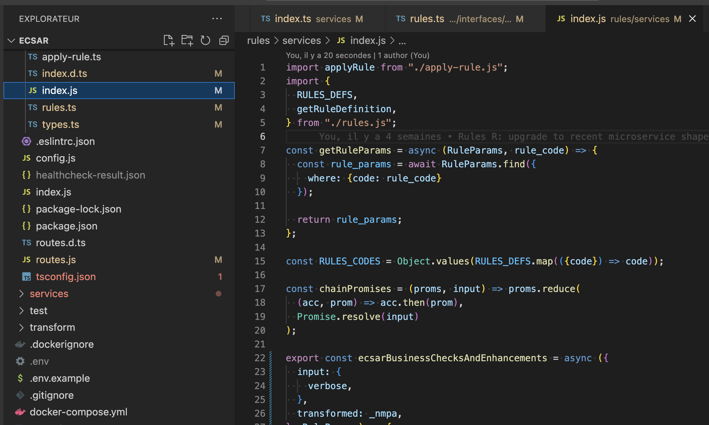

# Qualité du code et de la codebase
Qu'est-ce qu'une codebase de qualité? À quoi est-elle utile/bénéfique? À quel point est-elle profitable pour le projet, en terme de temps & délais, d'organisation, d'argent? Quels efforts l'équipe doit-elle produire (formation des collaborateurs, tâches "moins plaisantes" comme fix manuel des règles de lingting ou écriture des tests, temps supplémentaire pris par ces tâches de routine, etc)?

On va voir ici plein de concepts, dont certains se contredisent. Ne prenez rien pour acquis, mais je vous déconseille de jeter le bébé avec l'eau du bain ;-)

## C'est quoi, une codebase de qualité?
### De manière générale
On note dans le portail de la "Gestion de la qualité logicielle" (https://fr.wikipedia.org/wiki/Qualit%C3%A9_logicielle#Voir_aussi) des ensembles de pages dédiés à:
- Compréhension et contrôle du code source
- Remaniements (refactors)
- Principes de programmation
- Mauvaises pratiques

Ce portail regorge de notions intéressantes (oui, je parle bien de wikipedia), mais faire une formation dessus ne présenterait que peu de valeur ajoutée: après tout il vous suffit de cliquer sur des liens pour avoir du contenu à lire, et les articles wikipedia sont très souvent digestes et accessibles (contrairement aux articles de recherche ou aux brevets).

### C'est quoi, une codebase de mauvaise qualité?
Plutôt que de donner une définition quelque peu abstraite ici, passons en revue des situations courantes dans le monde du développement informatique:
- le code n'est pas lisible: gros pavés non aérés, lignes trop longues, ...
- le code n'est pas compréhensible: on n'arrive pas à voir d'organisation s'en dégager (des vues, layouts, composants génériques, composants spécialisés, presenters, data transformers, routes, contrôleurs, modèles, entités, authentification, helpers, code réutilisable, etc)
- le code et bug-prone (sujet/vulnérable aux bugs): un code où des objectifs/fonctionnalités différent(e)s se mélangent risque beaucoup plus une régression sur la fonctionnalité A lorsqu'on améliore la fonctionnalité B qu'un code où les obectifs ont correctement séparés, et bien indentifiables par les noms des variables et des fonctions.
- le code ne permet pas l'intégration / l'utilisation aisée d'outils d'aide à l'amélioration de la qualité du code: il est difficile de faire des tests unitaires (pas de dependency injection), les développeurs ne connaissent pas la commande pour linter le code, ...

// que fait ce paragraphe ici?
De manière générale, le développement initial est assez peu un problème ici: tous les devs savent développer une fonctionnalité. La qualité décrit le travail dont toute une partie des fichiers sera moins souvent réécrit, celui dans lequel on aura moins souvent de bugs & régressions; celui qui est agréable à consulter, compréhensible, maintenable et qui dure dans le temps.

#### Le code sujet aux bugs: illustration
Cette propriété est particulièrement injuste: en voici un exemple.

Imaginons les développeurs Alice et Bob: Alice produit un code clair, alors que Bob n'en n'a pas grand chose à faire (par exemple, Bob pourrait croire qu'une techno magique - au hasard typescript - est nécessaire et/ou suffisante pour faire de son code un code de grande qualité).

Bob développe les fonctionnalités A et B; les fonctionnalités sont là, mais le code est difficilement compréhensible, et très bug-prone. Alice doit intervenir sur la fonctionnalité A, et donc sur le code de Bob. Elle rencontre des difficultés à intégrer son travail (qui n'auraient pas existé si Bob avait fait quelque chose de qualité), et délivre finalement son code avec un délai de retard (par rapport à son estimation). Alice est une développeuse talentueuse (son style a déjà été mis en avant par ses collègues 'autre projets), mais son code n'est pas d'une aussi bonne qualité qu'elle aurait voulu (elle est perfectionniste): l'environnement ne le permettait pas et aurait nécessité un refactor de grande ampleur.

Quelques jours plus tard, le client se rend compte que la fonctionnalité B ne marche plus; Bob, après un rapide audit via le "git blame" intégré à VSCode pointe du doigt le travail récent d'Alice. Le client est très énervé (ça n'est pas le premier retard ni la première régression du projet, et c'est loin d'être la fin), et demande d'enlever un des deux développeurs du projet; en tant que lead dev, allez-vous essayer de préserver Alice ou Bob?

Un code de qualité n'est pas un code que vous avez écrit et trouvez clair, c'est un code que vous avez écrit et que les autres développeurs de votre équipe trouvent clair. Un code qui fait qu'ils risquent peu d'introduire des régressions.

### Quels causes à une baisse de qualité?
- un mauvais design: on appelle plus volontiers le design une architecture, dans notre discipline.
- les devs n'intègrent pas nativement dans leurs livrables / tâches des contrôles de la qualité du code, ni n'ont explicitement ce type de contrôles dans leur flow de réalisation d'une tâche. Il existe par exemple la code review, mais on peut songer à d'autres formes de contrôle comme une liste de points de contrôle.
- un projet ne permettant pas de lancer facilement des outils de contrôle automatisés: le linter doit s'interfacer avec l'IDE (bon le linter de vscode craint un peu, il faut installer manuellement l'exécutable eslint, c'est pas la faute du dev).

## Code de qualité et valeurs de Seagus
Si vous voulez relier le code de qualité aux valeurs de Saegus, un code de qualité:
- c'est agréable ("fun") à lire, et on est à l'aise sur un projet qui en a
- c'est l'excellence, presque par définition (en vrai c'est une bonne qualité et pas une excellente, mais je ne vais pas chipoter ^^)

Notez que si vous produisez de l'excellence, parfois elle ne se voit pas du premier coup d'oeil (un client qui est PO et donc souvent non tech va avoir du mal à comprendre la qualité de la codebase et des process d'équipe), c'est à vous de prendre le temps d'expliquer les tenants et aboutissants, de lui donner des métriques (régressions hebdo now VS il y a 2 mois) pour qu'il puisse mesurer la pertinence du clean code, et comment par exemple ça lui permet de mieux planifier le projet (moins de régressions = agenda plus prévisible), rendre ses utilisateurs heureux (les MEP contiennent moins de mauvaises surprises donc les users ouvrent moins de tickets), rendre ses développeurs heureux - car c'est rarement agréable de travailler au milieu d'un code spaghetti dont les noms des objets informatiques (fonctions, variables) n'ont que peu de sens.

## Axes d'amélioration
Grandes familles de pistes à explorer:
- communication d'équipe: cf précédemment
- process de travail normés: cf plus loin dans la formation
- une architecture à chaque niveau de granularité: projet (multi-composants), composant (un exécutable donné), fichier, fonction, ligne

### Exemples pratiques
Les technos / frameworks / etc listés ici n'y sont qu'à titre d'exemples, et on chacun au moins une alternative dans leur domaine. À vous de chercher!

#### Linting / formatting
##### ESLint
On en a déjà parlé avant comme un outil de règles communes d'équipe, ici on va le voir comme un moyen d'augmenter la qualité à l'échelle individuelle.

Les règles ESlint peuvent être classées de différentes manières:
- celles qui sont auto-fixables et celles qui ne le sont pas
- celles qui sont essentiellement stylistiques (ex.: quotes, comma-dangle), celles qui augmentent la lisibilité (ex.: max-lines-per-function) et celles qui permettent d'éviter des bugs (ex. no-undef)
- celles qui retournent souvent des endroits où la qualité du code peut être améliorée et celles qui retournent plus de "faux positifs"

Il est important de savoir pourquoi - et vous justifier si on vous demande quand - vous ajoutez chaque règle! Évitez dont de bêtement prendre le premier set de règles venu, ce qui peut être contraignant pour vos collègues voir contre-productif (en terme de lisibilité)!

##### Prettier
Il y a sûrement plein de choses bien à en dire - sa popularité ne sort pas de nulle part, mais je n'utilise pas l'outil donc je m'arrête là.

##### Sonarqube
Sonarqube est un outil open source d'analyse statique de code. Il est édité par SonarSource une boite qui vise à améliorer la qualité du code et sa sécurité.

C'est un outil mis en place dans la CI des projets d'un client populaire chez nous, tout le monde parmi nous sauf 1 travaille pour lui - et est donc a priori concerné ;-)

Je n'ai pas encore eu l'occasion de tester l'outil, je ne pourrais pas vous en faire un feedback.

Une note toutefois: Si SonarSource se vante d'être le plus gros fournisseur de solutions "Clean Code" en surfant sur la vague du mouvement éponyme, Uncle Bob n'a pas reconnu de lien avec ni émis d'opinion sur SonarSource ni SonarQube (info de janvier 2022). Le seul point commun est l'objectif affiché d'un code de qualité.

#### Typescript
L'écosystème typescript peut être vu aussi bien comme un linter type ESLint (mais non paramétrable) que comme un langage à part entière (mettant en avant sa caractéristique de langage typé).

##### REx eCSAR
Sur eCSAR, j'ai dû développer deux nanoservices, l'un scrappant les données de différentes APIs internes, et l'autre assemblant les données de ces différents API - avec notamment des jointures sur des champs.

Nous nous sommes retrouvés à régulièrement (plusieurs fois par mois) changer les APIS pour d'autres APIs ou d'autres versions. Les APIs renvoyaient des réponses aux schémas complexes, dont je n'avais pas de typage fourni a priori. Réécrire des types à chaque changement aurait été coûteux en temps, et l'expérience a montré que le peu de régressions qui a existé a été résolu assez rapidement. On a gagné du temps en n'utilisant que des maquettes & un healthcheck (une forme de test d'intégration) plutôt que typescript. 

D'autre part, le projet est centré sur de la data avec des règles métier complexes. Une partie de ces règles n'était tout simplement pas représentable avec Typescript, comme par exemple le fait que telle API ne nous renvoie que les FIL codes publiés, et pas l'ensemble des FIL codes qu'on lui a demandé en input.

Si typescript n'avait pas sa place sur ces composants logiciels, il a toutefois plus de pertinences à d'autres endroits; un autre composant logiciel, en charge d'appliquer des règles de validation et de transformation du formulaire NMPA précédemment généré, est composé d'un orchestrateur et de règles. En typant les deux et en prévoyant une structure modulaire, on a ajouté une documentation automatique à un code dont on a prévu préalablement les points fixes (l'orchestrateur ne devrait a priori plus être touché) et les points amenés à changer souvent (les règles elles-mêmes) dans le code.

Est-ce que TS est très utile ici? Je n'en sais pas grand-chose - après tout, le code des règles existantes sans TS (en JS pur) est une excellente base pour écrire une nouvelle règle par mimétisme; en tout cas TS ici ne devrait pas freiner le développeur avec des types trop rigides / incompréhensibles (par rapport à l'expérience du retrieve et du transform).

En bref, Typescript n'est pas adapté à tous les projets, et notamment pas à ceux dont des types peuvent évoluer régulièrement et dont on n'a pas la main dessus.

##### Avantages
- permet (souvent) d'éviter les erreurs d'inattention de typage
- interfaçage avec l'IDE (intellisense), au plus proche du moment de l'écriture du code (et pas en phase de déploiement/CI par ex.)
- permet de documenter efficacement (et en partie automatiquement, dépendant de l'usage qu'on en fait) des types pouvant être complexes sur des grosses application telles que celles qu'on écrit plus ou moins souvent. Pratique notamment pour le travail en équipe 
- maintenabilité: tendance à fixer le code / le rendre moins aisément réécrivable: pratique quand on est en train d'écrire une lib de fonctions/composants réutilisables, qui devraient peu/pas bouger dans le temps
- interfaçage avec des outils populaires comme swagger

##### Inconvénients
- norme beaucoup le style d'écriture du JS (cf annexe TS: style d'écriture)
- non paramétrable sur les règles de linting (contrairement à un linter classique)
- Configuration difficile: on aimerait par exemple avoir un mode qui transpile en JS en enlevant juste les annotations TS, sans réécrire le JS. On ne comprend pas pourquoi une fonction de transpilation de version de JS à été ajoutée obligatoirement au type checker et au transpiler TS->JS - qui auraient juste bien fait le job.
- potentiel de rendre le JS moins lisible V1: les annotations s'intriquant profondément dans le JS et, si on ne fait pas attention à son écriture, rend l'algorithmie difficile à lire
- potentiel de rendre le JS moins lisible V2: les @ts-ignore peuvent vite devenir envahissants si on n'y fait pas gaffe - au même titre que les annotations d'ignorance des linters.
- maintenabilité: tendance à fixer le code / le rendre moins aisément réécrivable: c'est gênant lorsqu'on doit faire évoluer des composants
- Des devs ont tendance à s'appuyer uniquement dessus pour la qualité de leur code, en négligeant les autres outils / leviers qui permettent d'avoir un code de qualité. Typescript est un outil parmi d'autres, ce n'est pas l'alpha et l'oméga
- Des devs ont tendance à mettre TS partout sans vraiment réfléchir à si il est pertinent de l'ajouter. Cf REx d'eCSAR.
- plus value diminuée (mais pas annulée) si on utilise des tests

#### Automatisation de la CI
Des flows populaires:
- Git flow: préfixage de branches avec automatisations de commandes git: https://docs.github.com/en/get-started/quickstart/github-flow
- One flow, une spin-off de Git flow
- Github flow: il s'agit d'un flow à features requests: https://docs.github.com/en/get-started/quickstart/github-flow
- Gitlab flow: ressemble un peu au Github flow
- Trunk-based development: on travaille sur une branche commune, avec parfois des feature branches: https://www.toptal.com/software/trunk-based-development-git-flow
- dev-based branch: ce flow est facile à mettre en place, et présente des avantages certains (responsabilisation du dev sur sa branche), mais présente aussi des inconvénients; suffisamment d'inconvénients pour qu'il ne soit pas conseillé à l'utilsation en équipe.

Quelques comparatifs:
- https://medium.com/@patrickporto/4-branching-workflows-for-git-30d0aaee7bf
- https://www.nicoespeon.com/fr/2013/08/quel-git-workflow-pour-mon-projet/

##### Un flow personnel
Je travaille souvent directement sur la branche de développement (`dev` chez moi). J'utilise rebase (plutôt que "squash", le mode par défaut). Je fais plein de petits commits, plutôt qu'un gros. Je stash plutôt que de faire des feature branches (même si j'en fais parfois). Avantages & inconvénients:
- en travaillant directement sur dev, mon code est plus facilement - et donc plus souvent - synchronisé (dans un sens ou dans l'autre) avec le code commun distant. Mes merge conflicts sont donc moins gros. Si utilisé avec des petits commits, mes merges conflicts sont souvent plus simples à gérer.
- le rebase rend certains merge conflicts plus longs à résoudre, d'autres moins.
- le rebase met en valeur les commits aux messages bien rédigés.
- le rebase vient avec plus de commandes git. Par exemple des stashs systématiquement avant les pulls. Pour contrebalancer cette charge supplémentaire, on peut créer des scripts (disons des scripts bash, normalement compatibles avec tous les OS), qui vont lancer ces commandes pour nous (checkout/pull/checkout/(merge/rebase)/checkout/rebase/push par exemple). On peut en profiter pour leur donner un peu d'intelligence afin qu'ils automatisent toujours plus le flow.

#### Automatisation de la CD
Outils populaires: Github Actions, Azure devops / pipelines, Jenkins

#### Docker
Docker est un peu hors scope, donc on va passer rapidement dessus.

C'est un compagnon idéal pour la portabilité (compatibilité), avec son bonus devops: environnements d'exécution uniformes pour tout les devs ainsi que pour les environnements déployés, ce qui permet d'éviter les classiques problèmes de différences d'environnements.

Pour un tuto sur docker, cf la dormation que j'ai donné en début d'année.

### Architecture
Définition (https://www.cnrtl.fr/definition/architecture): Principe d'organisation d'un ensemble, agencement, structure.

On peut inférer que l'architecture informatique est la manière de structurer un système informatique, mais aussi le code qui leui sert de base.

L'architecture informatique est comme l'architecture classique ou l'architecture d'intérieur. Il s'agit de décider de la disposition des pièces et meubles les uns par rapport aux autres, car chaque chose a une place: les chaussettes propres et sèches vont a priori dans la chambre, les couverts à la cuisine, etc. Et ceci car nos chaussettes servent à nous habiller, nos couverts à manger, etc. Dans notre codebase aussi, les bouts de code dont l'objectif, l'environnement (dont domaine technique/métier) et/ou les dépendances sont communes iront à des endroits similaires.

Toujours par analogie avec l'architecture classique, l'architecture informatique doit être adaptée aux besoins / spécificités du projet. Inutile "d'over-enigeer-er".

#### Quelques méthodologies et architectures connues
Je n'ai pas séparé architecture et méthodologie, car la plupart des architectures sont intrinsèquement liées aux méthodologies permettant de les mettre en place. C'est valable par exemple dans le cas de la 12FA.

Note: "Pattern" (motif en français) désigne également une forme (simple) d'architecture.

- MVC
- REST
- 12FA (twelve-factors app)
- Clean Code
- Clean Architecture
- Onion Architecture
- Hexagonale / Ports & Adapters
- Domain Driven Design (DDD)
- CQRS
- Event Sourcing
- Microservices
- MVVM
- TDD, BDD
- Flux
- LAMP

Pour une liste plus complète: https://fr.wikipedia.org/wiki/Cat%C3%A9gorie:Architecture_logicielle

#### Système de classement des normes architecturales
Dans le domaine du développeur comme dans celui des métiers de la maison, il y a plusieurs niveaux / grains d'action des règles d'architectures:
- gros grain: l'architecture d'urbanisme (ça s'appelle comme ça en informatique comme en architecture de ville).
- moyen-gros grain: l'architecture inter-exécutables, comparable à l'architecture d'un complexe (hôtelier), d'un quartier résidentiel ou d'un immeuble.
- moyen grain: l'architecture intra-exécutables, tel que l'architecture des pièces de l'appartement: l'emplacement des fenêtres, du garage, de l'atelier, du balcon, etc. En informatique, il s'agit de l'arborescence de fichiers, de ce qu'on pet dans chaque fichier et de comment on le nomme.
- grain fin: l'architecture intra-fichier, qu'on peut comparer à l'architecture d'interieur (mais aussi aux placements de sculptures et bas-reliefs sur une façade extérieure). On y parle notamment de nommage des fonctions et agencement de celles-ci entre elles. 
- grain très fin: l'architecture intra-fonction: nommage des variables, algorithmie, aération du code, taille des fonctions, ...



Ce moyen de classer les règles/normes d'architecture n'est bien sûr pas le seul, mais c'est celui que je vous propose d'utiliser ici. Une architecture va être un ensemble de ces règles, à un ou plusieurs niveaux. Par exemple, la méthodologie 12FA agit (au moins) aux granularités projet et composant.

Remarquez que si je ne parle pas du niveau "architecture intra-objet mais inter-fonction", c'est totalement volontaire:
- je n'aime pas l'OOP (parce que j'ai vu trop de codes obscurs en OOP et que j'aime bien le stateless), et m'en passe dès que je peux (c'est à dire pas loin de tout le temps)
- c'est une formation centrée autour du JS et, bien que le langage prévoit des structures orientées objet, on peut parfaitement s'en passer par exemple en utilisant des modules JS (UMD/CommonJS/ESM).
- il n'y a que peu à en dire de plus qu'au niveau des modules ESM, qui est normalement couvert par l'architecture intra-fichier.

##### Urbanisme
Cette discipline est plutôt orientée designers IT (pas nos designers UI/UX à Saegus) et administrateurs systèmes (gestionnaires de SI).

Il s'agit du niveau d'architecture où on organise les projets les uns par rapport aux autres. Exemples: APIGee, l'instance nginx-proxy-manager de notre serveur de dev, event-driven architecture (EDA), etc.

Cf https://fr.wikipedia.org/wiki/Urbanisation_(informatique) .

##### Entre les composants exécutables
Un composant exécutable d'un projet est un exécutable prévu en fonctionnement dans la phase d'exploitation nominale du projet.

Ici on est au plus haut niveau qui concerne un projet en particulier.
Exemple: Docker-Compose File (DCF), ressource (= serveur, type P1v3) & container Azure, microservices, event-driven architecture (EDA), twelve-factors app (12FA), etc.

###### REx
On parle souvent de microservices: c'est loin d'être systématiquement une bonne idée, par rapport à du monolithique... Attention à la lourdeur des interfaces de communication entre les différents composants (y compris au niveau de la gestion des erreurs, sérialisation d'éléments supplémentaires, toussa). L'expérience eCSAR me fait estimer à environ 3 semaines sur 34 le temps perdu par le fait d'avoir choisi une architecture microservices plutôt que monolithique (le choix n'est pas de moi), soit environ 9% du temps du projet.

De l'event-driven pour la communication entre les composants est aussi possible et assez scalable (kafka, RabbitMQ, ...), même si ça nécessite des connaissances / une expérience spécifique(s) pour éviter de faire du code spaghetti - et donc une équipe formée à cette manière de faire.

##### À l'intérieur du composant exécutable
On parle ici essentiellement de l'arborescence des fichiers, et de quel fichier est sensé contenir quel genre de code.
Exemple: MVC, MVVM, DDD, Yelling Architecture, Clean Architecture, Onion Architecture, Ports & Adapters, data/network/... layer, etc.

##### À l'intérieur du fichier
###### Clean Code
Clean code est un ensemble de règles établies empiriquement par Robert C. Martins dans le livre éponyme. L'homme est également connu sous le pseudonyme "Uncle Bob", et est le père de la méthodologie SOLID (orientée objets, mais très intéressante dans d'autres perspectives), et de "Clean Architecture", et co-auteur du "Manifeste Agile".

Voici une sélection toute personnelle de quelques principes de Clean code, pour que vous puissiez vous imaginer de quoi il retourne:
- noms des variables (dont fonctions) (chap. 2)
- fonctions (chap. 3)
  Comme je l'ai dit à plusieurs d'entre vous à une formation précédente, une fonction de 100+ lignes ça n'existe juste pas, et une fonction de 60+ lignes c'est rare et spécifique au JSX; pour le JS, la moyenne devrait être à 20-30 lignes, et le max à 40. Aller au-delà de cette ligne, c'est très probablement intriquer différents objectifs, et c'est le début d'un code spaghetti, ou d'un God Object.
- commentaires (chap. 4)
- formatage: taille de fichier & aération du code (chap. 5)
- itérations courtes (dont tâches) et refactoring régulier (chap. 14)

Les parties de formation `clean-code.md` et `new-feature-SoC.md` qui suivront rentreront plus dans le détail et dans le concret / l'illustration, respectivement. 

##### REx
Ex: si différentes temporalités, de l'event-driven est intéressant.

Ex: Pour des cas de traçabilité, penser à l'event sourcing.

Ex: Au cas où le domaine métier (plus précisément les objets à faire persister) est complexe, on peut utiliser du DDD

De manière générale, faire du SoC au niveau des fichiers (1 objectif max par fichier) c'est bien. Également, une architecture de fichier parlante c'est bien également, la screaming architecture en est un très bon principe (que le DDD met en place d'ailleurs).

À mon niveau, tant qu'il n'y a pas de besoins spécifiques, pour un back par exemple j'utilise:
- un dérivé de MVC (Modèle-Contrôleurs-Services)
- en séparant différents modules non-métier assez communs dans des dossiers dédiés: routage, authentification, scripts d'initialisation, gestion des erreurs, éventuels appels réseau, ...
- L'idée de séparer le code métier du code "technique" est inspirée de Clean Architecture(d'autres archis le font également), qui veut séparer le code "d'infrastructure" du code "métier"
- Au coeur de la réflexion également: une architecture connue est plus à même d'être maîtrisée par toute l'équipe / les nouveaux arrivants, et donc moins de risque de la casser.
- j'évite au possible le code stateful - et donc les classes. Il y en a uniquement aux endroits où elles sont significativement plus adaptées que du code non-objet, comme par exemple une API nécessitant des credentials, que je vais appeler un certain nombre de fois, potentiellement éloignés de là où je lui passe ses credentials.
- Pour le nommage de mes variables et noms de fonctions, j'utilise notamment (mais pas que) le language ubuquitaire tel que défini par le DDD - disons plus simplement le "langage métier". Ils doivent révéler l'intention du développeur; par exemple, ça permet à celui qui passera ensuite de déterminer si il doit plutôt modifier cette fonction (et de quelle manière) ou en créer une nouvelle.
- loi de demeter: une fonction ne dépend pas des implémentations des autres fonctions qu'elle appelle. Uniquement de la processe du résultat délivré, qu'on infère via le nom de la fonction. 
- fonctions pures: mes fonctions sont au possible sans effets de bords. Une bonne partie des fonctions d'un dev junior peuvent s'inspirer des différents tutos sur l'immutabilité en JS pour voir comment faire.
- CQRS revisité V1: mes fonctions sont au possible immutables, car les effets de bords ne sont pas très compatibles avec la qualité.
  * soit des fonctions "de haut niveau", orchestratrices d'autres fonctions, 
  * soit des fonctions qui agissent sur un objet et un objectif défini (utilisant directement ou indirectement au plus un import ou une famille d'imports - comme les modèles)
- CQRS revisité V2 + bonus fonctions pures: au possible, mes fonctions agissent sur des variables:
  * internes, en les créant, les accédant et les modifiant 
  * passées en argument, mais ne les modifient pas et retournent une valeur ("Query").
  * passées en argument, les modifient mais ne retournent pas de valeur ("Command"). Cette dernière catégorie doit être restreinte au minimum, cf fonctions pures.

Bref, je mange - sans complexe - à tous les rateliers (de l'architecture logicielle) ^^'

### Patterns & anti-patterns
Il s'agit d'une sélection minimaliste de divers motifs architecturaux que j'ai régulièrement croisé dans mes lectures de code, et/ou qui sont particulièrement connus.
Ces motifs ont également une importance supérieure à beaucoup d'autres de même niveau (sans vouloir rabaisser les autres), et sont relativement faciles à corriger.

Attention: même si cette liste est un bon point de départ, elle est insuffisante pour écrire du bon code. Je vous suggère dès votre compréhension de ces motifs de:
- Apprenez le JS. Tout le monde n'a pas l'air de connaître Array.reduce() / Array.map() / Array.filter() de la librairie standard dans la team, c'est chaud (problématique) si vous faites du JS depuis plus d'un an. On parle d'ES2015 hein, sorti il y a environ 8 ans. Pour les méthodes d'Array: https://developer.mozilla.org/en-US/docs/Web/JavaScript/Reference/Global_Objects/Array/Array; et pour Object: https://developer.mozilla.org/en-US/docs/Web/JavaScript/Reference/Global_Objects/Object
- nommez correctement vos variables (dont fonctions)
- lisez Clean Code

##### Patterns
- SoC / SRP (le "S" de SOLID) / etc: on sépare le code en objectifs différents. Sûrement le principe le plus important pour la mise à l'échelle d'une codebase.
- Open/Closed principle, ou "principe des plugins" (le "O" de SOLID): quand on branche un plugin à un logiciel, le plugin en change pas le code interne du logiciel, mais change quand même sa manière de fonctionner: il peut faire ça en donnant au logiciel des inputs différents, et notamment des hooks. C'est excellent pour la modularité du code, et donc son évolutivité.

##### Code smells
- god object / code spaghetti: le contraire du SoC
- magic numbers https://dev.to/producthackers/code-smell-magic-numbers-3ngc et https://haridy29.medium.com/magic-numbers-2df3ae9dec94

Pour plus de code smells, allons voir rapidement Clean Code, chapitre 17: Smells and Heuristics.

#### Tests
##### Raisons de tester
- le métier a besoin de s'assurer de non-régressions fonctionnelles:
  - sur les fonctionnalités de l'UI
  - sur des specs d'API
- l'équipe de dev veut:
  - valider le schéma du retour des composants logiciels "finaux" (front, back) (tests sur le typage)
  - garantir l'uptime des composants logiciels finaux
  - garantir l'uptime des composants logiciels intermédiaires (composants / bibiliothèques / services consommés par les fronts & backs monolithiques d'apps)
  - de la documentation des composants qu'elle utilise
  - inscrire certains composants / bibiliothèques sur la durée

##### Types de tests
3 grandes familles de tests automatisés:
- end-to-end: TODO
- intégration: TODO
- unitaires: On teste une fonction, ou un ensemble de fonctions ()

En détaillant par utilisateur cible, grande famille ainsi que degré d'automatisabilité:
- Responsabilité (création et maintenance) transférable à des non-devs:
  - tests manuels d'UI (end-to-end): un membre non-dev et non-data (ie n'importe qui) peut s'en charger
  - tests manuels d'API (intégration): un membre data / tech-friendly peut s'en charger, par exemple avec une connaissance minimaliste de Postman.
  - tests semi-automatisés d'API (intégration): un membre data / tech-friendly peut s'en charger. Postman possède un langage spécifique pour les tests. Il peut tester des schémas (validation) comme des valeurs de réponses, ainsi naturellement que des codes HTTP de réponse; dans le cadre d'un non-dev, on se limitera à tester des codes HTTP et éventuellement quelques valeurs de réponse.
- Responsabilité incombant à l'équipe de dev, ou à des testeurs professionnels:
  - tests automatisés d'API (intégration): Ex:
    - Supertest (avec Jest)
    - OpenAPI + @openapi-contrib/openapi-schema-to-json-schema + Newman / Postman CLI
    - Hurl (hurl.dev)
  - tests automatisés d'UI (end-to-end): Ex.: Cypress
  - tests automatisés d'UI (unitaires): Ex.:
    - @testing-library/angular
    - @testing-library/react
    - Enzyme (pour React)
  - tests automatisés de composants backend (unitaires): Ex.: Jest, Mocha

##### Astuces de mises en place efficace de tests
Automatisation de la maintenance des tests, avec le swagger comme source de vérité: Swagger + @openapi-contrib/openapi-schema-to-json-schema + Newman / Postman CLI + (éventuellement) léger script bash pour générer les tests à partir des JSON schémas

Exécution des test dans le process de développement d'une feature:
- avant commit (locaux, durée <30s - idéalement 10-15s)
- avant push (locaux, durée < 5 min)
- avant "Ready For Testing" (dans la CI/CD)

Les tests unitaires sont les plus rapides à exécuter, et donc des candidats idéaux avant commit. Toutefois certains tests d'intégration peuvent également être mis en place à ce moment.

On peut optimiser la durée d'exécution des tests (pour les tests pré-commit) en ne testant qu'une partie de la codebase. Par exemple, `jest --findRelatedTests <liste de fichiers>` auquel on transmet la liste des fichiers staged - en se servant de `git status --porcelain` ou de `lint-staged`.

On peut difficilement être plus précis quant à la durée d'exécution des tests, dans la mesure où elle dépend également:
- du nombre de tests, qui dépend de la complétude de la couverture de code souhaitée, mais aussi de la maturité de l'application testée.
- de l'utilisation de mocks, et de leur nature: JSON, mock de DB (et donc phases de seeding et de cleaning), etc.
- de la nature du projet: un test d'intégration sur une API HTTP mono-route sans DB qui ne nécessite qu'un ou 2 appels pour tester l'ensemble de ce qu'on veut tester est avantagée par rapport à un backend d'app plus classique.


Dans tous les cas, on souhaite que les tests avant commit n'interfèrent pas avec le développement local. Ie on veut que les tests se lancent sur notre code modifié alors même qu'on continue à développer, sans devoir s'interrompre plus de 30s entre la sauvegarde du fichier et le moment où on peut effectivement tester manuellement le résultat de notre modification (logs d'API d'une requête, où manipulation de l'UI). 

## Techniques spécifiques
### Guidelines de dev
TODO: cf les guidelines de contribution sur github de technos populaires: Angular, React, Next.js, Vite, Webpack, Mongoose, Prisma, Sequelize.

#### React
https://legacy.reactjs.org/docs/how-to-contribute.html

#### Angular
https://github.com/angular/angular/blob/main/CONTRIBUTING.md#-submission-guidelines
https://github.com/angular/angular/blob/main/CONTRIBUTING.md#-coding-rules

#### Next.js
https://github.com/vercel/next.js/blob/43b075eb7ee6b4e0a92d3b8caf2de5b634f3540b/contributing.md
(un peu différent des autres)

#### Vite.js
https://github.com/vitejs/vite/blob/main/CONTRIBUTING.md#pull-request-guidelines
https://github.com/vitejs/vite/blob/main/CONTRIBUTING.md#maintenance-guidelines

#### Webpack
https://webpack.js.org/contribute/
https://github.com/webpack/webpack/blob/main/CONTRIBUTING.md

#### Sequelize
TODO

#### Mongoose
TODO

#### Prisma
TODO

### Résumer efficacement un daily
TODO

### Signaler un bug / un comportement étrange à un dev
Nous travaillons avec des systèmes complexes. À l'instar des docteurs et du corps humain, nous et notre logiciel avons besoin de différents éléments de diagnostics pour poser un diagnostic de ce qui ne va pas, avant de le résoudre: radios, analyses sanguines et ausculataion au stéthoscope deviennent logs applicatifs, `console.log()` placés ponctuellement et debuggers.

Dans ce cadre, il nous arrive régulièrement d'avoir à échanger autour de nos problèmes avec des collègues pour résoudre des problèmes.

Il est donc fondamental:
- de savoir fournir le plus de données possibles à l'établissement du diagnostic, et en premier lieu différents types de logs: logs de sortie et d'erreur d'un routeur, logs applicatifs de (node, docker, ...), sortie d'une commande (par exemple pour le build d'une image docker, le mieux est la sortie de `docker compose build <service> --progress=plain`), logs systèmes (ex.: dmesg, journalctl), etc
- de savoir parmi tous les outils qu'on a sous la main lesquels sont les plus pertinents (histoire de ne pas flooder notre interlocuteur d'informations inutiles)
- de savoir ajouter les éléments pertinents à sa demande d'aide. Votre interlocuteur n'est pas dans votre tête: à vous de lui fournir suffisamment d'éléments pour:
  1. d'une part qu'il comprenne votre objectif: "je veux ... et pour ce faire, j'ai besoin de ... mais je suis bloqué par ..."
  2. d'autre part qu'il juge si il a les connaissances nécessaires pour vous aider,
  3. également que vous êtes dans une situation suffisamment problématique pour qu'il vous accorde son temps (son temps est précieux, ne le gâchez pas sans avoir déjà sérieusement cherché des solutions de votre côté)
  4. et enfin qu'il ait un minimum (voir pas) de questions à vous poser: minimisez les allers-retours
- de savoir bien formuler sa demande d'aide:
  * par exemple commencer sa demande par "ça ne marche pas (quand je fais X)" puis attendre qu'on nous réponde, c'est pas très efficace - ni très respectueux de votre interlocuteur. C'est mieux si vous fournissez la liste exhaustive des actions faites / commandes lancées en vous étant assuré que le comportement est bien évidmment reproductible, ainsi qu'un retour exhaustif du système menant au comportement problématique: par exemple si il s'agit d'une commande, l'ensemble de la sortie de la commande depuis son lancement (et pas juste les 5 dernières lignes).
  * D'autre part, soyez polis et concis: le temps de votre interlocuteur est précieux, ne le gâchez pas. Si vous avez du mal à visualiser ce point, imaginez que vous vous adressez à David ou Frédéric.
  * la (quasi-?)totalité des projets populaires sur Github possèdent des formulaires d'ouvertures de github issues de technos populaires: Angular, React, Next.js, Mongoose, Prisma, Sequelize. On peut d'ailleurs aller y faire un tour rapide, pour voir à quoi ils ressemblent.

Quelques exemples sur de gros projets open source:
- https://github.com/facebook/react/issues/new/choose
- https://github.com/angular/angular/issues/new/choose
- https://github.com/vitejs/vite/issues/new/choose

### Le boy scout (hors Clean Code)
On laisse le code dans un aussi bon état - voir meilleur - que celui dans lequel on l'a trouvé. Par exemple, si on trouve un comportement suspect:
- on essaie de reproduire, comprendre et faire cesser ce comportement, si c'est à notre portée
- on signale ce comportement à l'équipe, avec laquelle on collabore potentiellement en tant que lanceur de l'alerte initiale.

### La SoC pendant le dev d'une nouvelle feature
Cf `./new-feature-SoC.md`

### La méthodologie Clean Code
Cf `./clean-code.md`

### Code reviews
On en reparlera après avoir revu Clean Code. Ayez en tête l'image des "WTFs/min".

## Annexes
### Typescript
#### Typescript norme le style d'écriture
Voici deux exemples:
```
interface IMyObj {
  warning: string;
  warn: string;
  total_length: number;
};

type TTempObj = Omit<IMyObj, "total_length">;

const warningAttr = (): string => "a warning";
const warnAttr = (): string => "another warning";
const getTotalLength = (res: TTempObj): number => res.warn.length + res.warning.length;
// error TS2322: Type '() => { warning: string; warn: string; }' is not assignable to type '() => IMyObj'.
//   Property 'total_length' is missing in type '{ warning: string; warn: string; }' but required in type 'IMyObj'.
const propertyTotalLengthIsMissingOnType: () => IMyObj = () => {
  const res = {
    warning: warningAttr(),
    warn: warnAttr(),
  };

  // J'ajoute une prop générée (en partie) à partir des props actuelles de l'objet
  // error TS2339: Property 'total_length' does not exist on type '{ warning: string; warn: string; }'.
  res.total_length = getTotalLength(res);
  return res;
};

interface IMyOtherObj extends Omit<IMyObj, "total_length"> {
  total_length?: number;
};

// Petite variation: l'ajout conditionnel d'une prop
const propertyTotalLengthDoesNotExistOnType: (add_total: boolean) => IMyOtherObj = (add_total) => {
  // error TS2339: Property 'total_length' does not exist on type '{ warning: string; warn: string; }'.
  // Si on met un type "any" pour se débarasser de cette erreur: on perd la vérification des attributs de IMyOtherObj, et on peut se retrouver avec un attribut "error" au milieu de notre objet sans que TS ne nous le notifie. 
  const res = {
    warning: "a warning",
    warn: "another warning",
  };

  if (add_total) {
    res.total_length = 50;
  }

  return res;
};

```
Dans ces 2 cas, on ne peut pas ajouter une prop à notre objet intermédiaire, alors même que notre algorithme renverra dans 100% des cas un objet de type correct. C'est une limite du compilateur statique, qui prend en compte en retour de fonction le type de l'objet à sa création, et pas le type de l'objet au moment du retour comme on pourrait le penser intuitivement.
